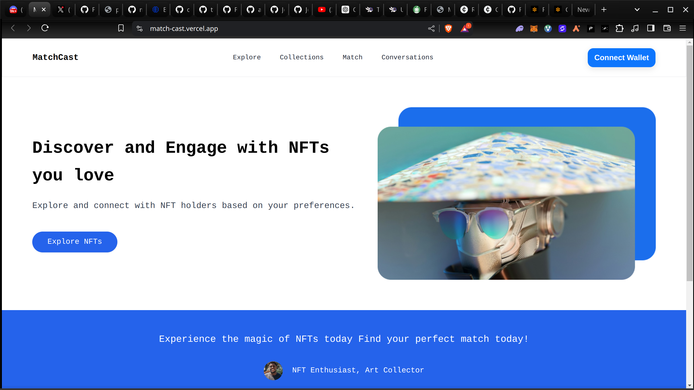
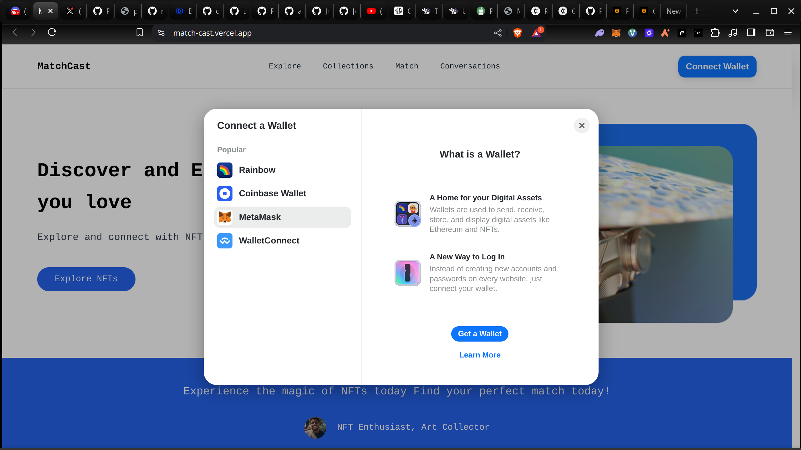
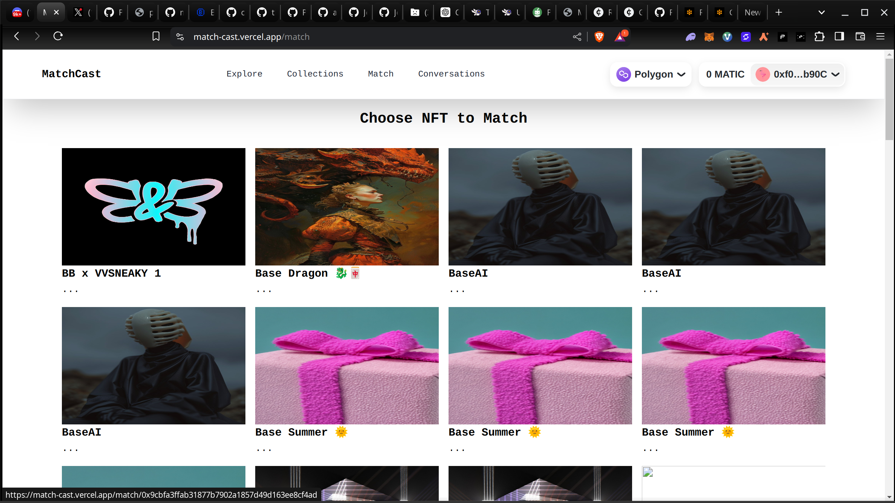
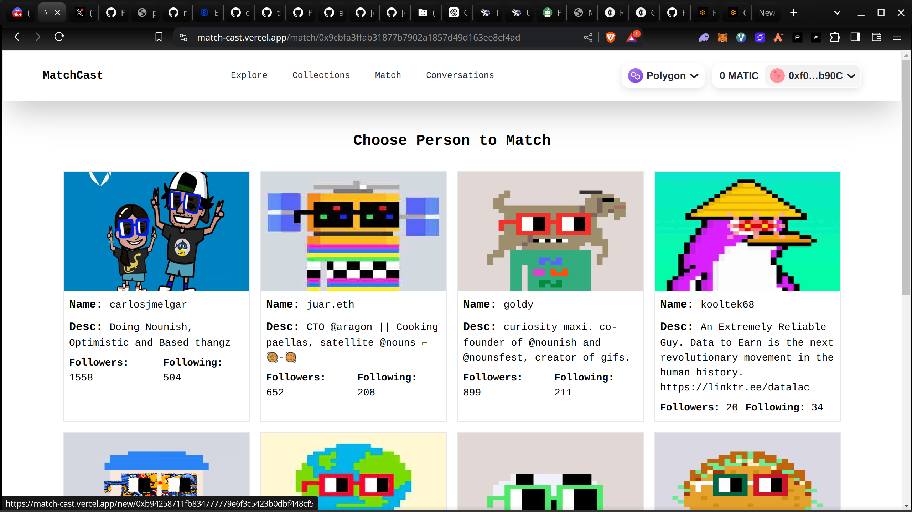
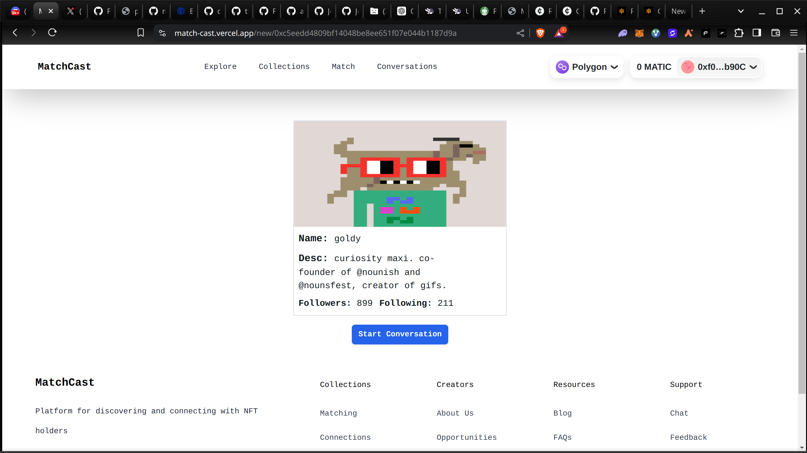

# Matchcast
### Happy matching!

Welcome to Matchcast, a revolutionary NFT-based matchmaking tool that revolutionizes how you connect with people by combining the power of the Farcaster API with the distinct digital identities afforded by NFTs. Matchcast transforms your digital assets into more than simply collectibles; they reflect your identity, hobbies, and interests, guiding you to meaningful interactions with like-minded folks.

## Table of Contents

1. [Key Features](#key-features)
2. [Website](#website)
3. [Frame](#frame)
4. [Demo Video](#demo-video)
5. [Screenshots](#screenshots)
6. [Getting Started Locally](#getting-started-locally)

## Key Features

- **NFT-Based Profiles**: Display your NFT collection as a distinct reflection of your digital identity. Every NFT contains a tale about who you are, making your profile truly unique and personal.
- **Intuitive Simple Interface**: Matchcast presents users with a seamless, intuitive experience. It's designed to make meeting new people as simple and enjoyable as possible, so you can focus on building connections.
- **Warpcast Integration**: View and interact with Farcaster Warpcast profiles directly within Matchcast. This integration connects your social media presence to your matchmaking quest, providing a holistic approach to your online identity.
- **XMTP Secure Messaging**: Use XMTP to communicate privately and securely with your matches. Ensuring that your interactions are safe and decentralized, XMTP provides peace of mind as you build new relationships.


## Usage

- **Create your profile**: Connect your wallet to create your profile and select NFTs that best represent you. Your profile becomes a unique showcase of your digital persona, allowing others to see the digital assets that define you. Whether it's rare art pieces, collectible items, or unique digital creations, your NFTs tell the story of your interests and values.
- **Browse profiles**: Search through a vibrant array of profiles to discover individuals who share your NFT interests and values. The intuitive interface makes it easy to find potential matches, turning the search into an enjoyable exploration of the digital world. Each profile offers a glimpse into your unique NFT collection, sparking curiosity and interest as you explore the diversity of digital identities.
- **Match and chat**: When you find a mutual match, the real magic begins. Start a conversation using XMTP's secure messaging system, knowing that your interactions are safe and decentralized. Whether it's discussing shared interests, planning virtual meetups, or exchanging stories about your favorite NFTs, the chat feature ensures your conversations are private and secure. It's more than just messaging; it's about building meaningful connections in the digital age.


## Website

Matchcast Website Can be Found here [Matchcast website](https://match-cast.vercel.app/).

## Frame 

Matchcast frame Can be Found here [Matchcast Frame](https://framr.vercel.app/api)

## Demo Video

Watch our [demo video](https://www.loom.com/share/87bd268f6f74479797d7a52c85bb68f3) to see Matchcast in action.

## Screenshots







## Getting Started Locally

Ready to dive in? Follow these steps to get Matchcast up and running on your local machine for development and testing.

### Installation

   ```bash
   git clone https://github.com/Joshaw-k/MatchCast.git
   ```


   ```bash
   npm install
   ```

   ```bash
   npm run dev
   ```

 Open your browser and navigate to `http://localhost:5173`.


 Thank you for choosing Matchcast! We're excited to have you on this journey of revolutionizing matchmaking through NFTs. If you have any questions, feedback, or need assistance, please don't hesitate to open an issue on GitHub or reach out through our website.


---

Happy matching!

---
